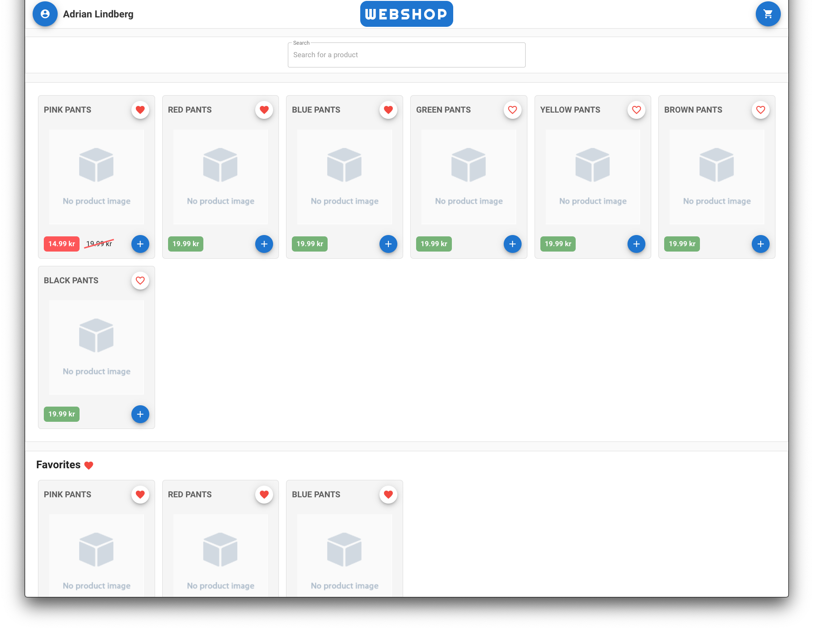

# Fullstack Webshop

## Project setup

```
docker-compose up --build
```

Starts client on port `8080` and server on port `8081` as default.

## Description

Simple fullstack application to show off some front end & back end skills.

## Dependencies

- yarn
- docker
- docker-compose
- vue-cli

## Screenshots



